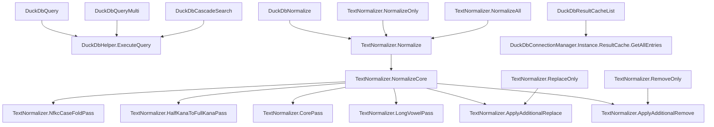

# xlDuckDb 関数仕様一覧

## 1. Excelアドイン関数（xlAddIn.cs）

### DuckDbQuery
- **概要**: 単一のDuckDB SQLクエリを実行し、2次元配列で返す
- **引数**:
  - `query` (object): SQL文（文字列またはセル参照）
  - `dataSource` (string): .duckdbファイルパス（空文字でインメモリDB）
- **戻り値**: object[,]（クエリ結果、エラー時はExcelError）
- **制限**: SQL内でパラメータバインディング不可、値は直接埋め込む
- **コールグラフ**:
    - DuckDbQuery
        - DuckDbHelper.ExecuteQuery

---

### DuckDbQueryMulti
- **概要**: セル範囲の複数SQLを順次実行し、UNION ALLで連結
- **引数**:
  - `sqlRange` (object): SQL文のセル範囲
  - `dataSource` (string): .duckdbファイルパス
- **戻り値**: object[,]（全クエリの連結結果）
- **制限**: 列数不一致時はエラー、パラメータバインディング不可
- **コールグラフ**:
    - DuckDbQueryMulti
        - DuckDbHelper.ExecuteQuery

---

### DuckDbCascadeSearch
- **概要**: セル範囲の複数SQLを順次実行し、累計行数がmaxRowsに到達するまでVSTACKで返す
- **引数**:
  - `sqlRange` (object): SQL文のセル範囲
  - `dataSource` (string): .duckdbファイルパス
  - `reserved` (object): 予約（未使用）
  - `maxRows` (int): 最大累計出力行数
- **戻り値**: object[,]（累計maxRowsまでの連結結果）
- **制限**: パラメータバインディング不可
- **コールグラフ**:
    - DuckDbCascadeSearch
        - DuckDbHelper.ExecuteQuery

---

### DuckDbNormalize
- **概要**: テキスト正規化（NFKC, 半角カナ, 空白, 絵文字削除など）を適用し、最終結果を返す
- **引数**:
  - `input` (object): 文字列またはセル範囲
  - `normalizeOptions` (double): ビットフラグ（例: 511=全適用）
  - `additionalRemove` (string): 追加削除文字
  - `additionalReplace` (string): 追加置換（from,toペア）
- **戻り値**: string または object[,]（セル範囲の場合）
- **制限**: オプション値は `NormalizeOptions` のビット和
- **コールグラフ**:
    - DuckDbNormalize
        - TextNormalizer.Normalize

---

### DuckDbResultCacheList
- **概要**: DuckDBクエリ結果キャッシュの一覧（キャッシュキー・SQL・行数）を返す
- **引数**: なし
- **戻り値**: object[,]（[DataSource, SQL, RowCount]の2次元配列）
- **制限**: キャッシュが空の場合はヘッダーのみ
- **コールグラフ**:
    - DuckDbResultCacheList
        - DuckDbConnectionManager.Instance.ResultCache.GetAllEntries

---

## 2. TextNormalizerユーティリティ関数（TextNormalizer.cs）

### Normalize
- **概要**: テキストに正規化オプション・追加削除・追加置換を適用
- **引数**:
  - `input` (string)
  - `options` (NormalizeOptions)
  - `additionalRemove` (string?)
  - `additionalReplace` (string?)
- **戻り値**: string
- **制限**: キャッシュ有効、全オプション組み合わせ可
- **コールグラフ**:
    - Normalize
        - NormalizeCore
            - NfkcCaseFoldPass
            - HalfKanaToFullKanaPass
            - CorePass
            - LongVowelPass
            - ApplyAdditionalReplace
            - ApplyAdditionalRemove

---

### NormalizeOnly
- **概要**: 正規化のみ（追加削除・追加置換なし）
- **引数**: `input` (string), `options` (NormalizeOptions)
- **戻り値**: string
- **コールグラフ**:
    - NormalizeOnly
        - Normalize

---

### RemoveOnly
- **概要**: 追加削除のみ（正規化・追加置換なし）
- **引数**: `input` (string), `removeSpec` (string)
- **戻り値**: string
- **コールグラフ**:
    - RemoveOnly
        - ApplyAdditionalRemove

---

### ReplaceOnly
- **概要**: 追加置換のみ（正規化・追加削除なし）
- **引数**: `input` (string), `replaceSpec` (string)
- **戻り値**: string
- **コールグラフ**:
    - ReplaceOnly
        - ApplyAdditionalReplace

---

### NormalizeAll
- **概要**: 正規化・追加削除・追加置換をすべて適用
- **引数**: `input` (string), `options` (NormalizeOptions), `additionalRemove` (string?), `additionalReplace` (string?)
- **戻り値**: string
- **コールグラフ**:
    - NormalizeAll
        - Normalize

---

## 3. 制限事項まとめ
- SQL関数群はDuckDB.NETの制約によりパラメータバインディング不可
- 正規化関数は.NET 8 標準APIのみ利用（ICU等外部依存なし）
- キャッシュサイズや最大出力行数は環境変数や設定で制御可能

---

## 4. コールグラフ（全体イメージ）

